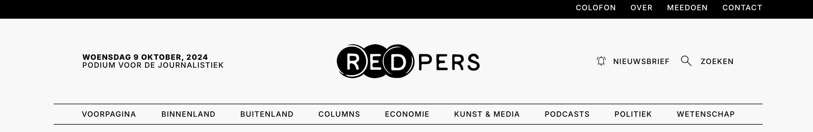
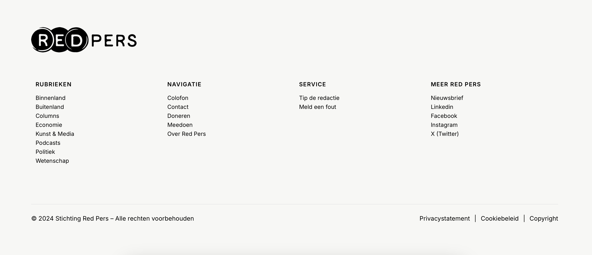
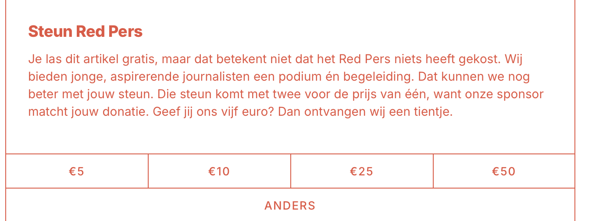
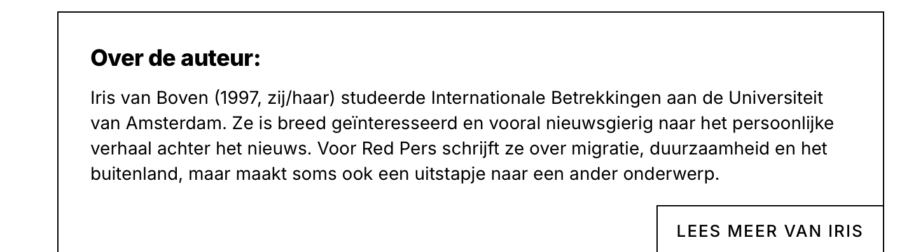

🌸🌸🌸🌸🌸🌸🌸🌸🌸🌸🌸🌸🌸🌸🌸🌸🌸🌸🌸🌸

# The Client - Website 🌐
**HTML5 | CSS3 | JavaScript**

Ontwerp en creëer een moderne en functionele website voor een opdrachtgever en bespreek het resultaat tijdens de Sprint Review.

📋 De instructie van deze leertaak staan in de [INSTRUCTIONS](#).

🌸🌸🌸🌸🌸🌸🌸🌸🌸🌸🌸🌸🌸🌸🌸🌸🌸🌸🌸🌸

## 📑 Inhoudsopgave
- [Beschrijving](#beschrijving)
- [Kenmerken](#kenmerken)
- [Screenshots van de originele versie](#screenshots-van-de-originele-versie)
- [Leerdoelen](#leerdoelen)
- [Bronnen](#bronnen)
- [Licentie](#licentie)

🌸🌸🌸🌸🌸🌸🌸🌸🌸🌸🌸🌸🌸🌸🌸🌸🌸🌸🌸🌸

## ✨ Beschrijving
Dit project is uitgevoerd voor **Redpers**, een journalistiek platform. Het doel was om de artikelpagina visueel aantrekkelijker en volledig responsive te maken, zodat de gebruikerservaring op alle apparaten goed werkt. De opdrachtgevers wilden een modern ontwerp, een toegankelijke navigatie en een verbeterde leeservaring voor gebruikers.

De belangrijkste verbeteringen zijn:
- 🎨 **Navigatie**: Een dropdown-menu met overlay voor betere toegankelijkheid en een gebruiksvriendelijke interface.
- 💬 **Donatie Pop-up**: Een pop-up die automatisch verschijnt wanneer de gebruiker 50% van de pagina heeft gescrold, om interactie en donaties te stimuleren.
- 📊 **Leesvoortgang**: Een voortgangsbalk die de gebruiker laat zien hoeveel van het artikel is gelezen.
- 📈 **View-counter**: Houdt bij hoe vaak een artikel is gelezen en slaat deze informatie op met `localStorage`.
- ✨ **Animaties**: Hover-effecten en bewegende iconen zorgen voor een dynamische gebruikerservaring.
- 🎨 **Kleuren**: Er is een breder kleurenpalet toegepast om de pagina’s visueel aantrekkelijker te maken.

🌸🌸🌸🌸🌸🌸🌸🌸🌸🌸🌸🌸🌸🌸🌸🌸🌸🌸🌸🌸

## 🚀 Kenmerken

| Technologie  | Beschrijving |
|--------------|--------------|
| **HTML**     | Semantische elementen zoals `<header>`, `<section>`, `<footer>`. Toegankelijkheid verbeterd met aria-attributen. |
| **CSS**      | Flexbox voor een responsieve lay-out. Animaties en transitions voor visuele feedback (zoals hover-effecten). |
| **JavaScript** | Functionaliteit voor dropdown-menu en donatie pop-up na 50% scrollen. Voortgangsbalk voor artikel leesvoortgang. |

🌸🌸🌸🌸🌸🌸🌸🌸🌸🌸🌸🌸🌸🌸🌸🌸🌸🌸🌸🌸

## 📸 Screenshots van de originele versie

### Originele Navigatie
|  |

### Originele Footer
|  |

### Originele Donatiepagina
|  |

### Originele Auteurspagina
|  |

## 🔗 Bekijk de veranderingen

## 🔗 Bekijk de veranderingen
- Het navigatiemenu is verbeterd met een dropdown en overlay-functionaliteit voor betere toegankelijkheid.
- Er is een leesvoortgangsbalk toegevoegd, zodat gebruikers kunnen zien hoe vaak het artikel is gelezen.
- Een donatie pop-up verschijnt automatisch bij 50% scrollen, om gebruikers te stimuleren te doneren.
- Animaties en een vernieuwd kleurenschema maken de pagina visueel aantrekkelijker en interactiever.
- De pagina is nu ongeveer 70% responsive, met verdere verbeteringen gepland voor volledige responsiviteit.

🔗 [Originele pagina](https://redpers.nl/2024/02/20/carriere-maken-als-amsterdamse-polaroidfotograaf-soms-is-het-een-strijd-om-de-nacht/)  
🔗 [Veranderde versie (mijn project)](https://fatimahilali.github.io/the-client-website/)

🔗 **Links:**
- [Originele pagina](https://redpers.nl/2024/02/20/carriere-maken-als-amsterdamse-polaroidfotograaf-soms-is-het-een-strijd-om-de-nacht/)
- [Veranderde versie (mijn project)](https://fatimahilali.github.io/the-client-website/)

🌸🌸🌸🌸🌸🌸🌸🌸🌸🌸🌸🌸🌸🌸🌸🌸🌸🌸🌸🌸

## 🎯 Leerdoelen

-  Diepgaande kennis van semantische HTML en toegankelijkheid.
-  Verbeterde kennis van Flexbox voor responsieve lay-outs.
-  JavaScript toegepast voor dynamische functies zoals view-counters en voortgangsbalken.

🌸🌸🌸🌸🌸🌸🌸🌸🌸🌸🌸🌸🌸🌸🌸🌸🌸🌸🌸🌸

## 📚 Bronnen

- [Carrière maken als Amsterdamse polaroidfotograaf: ‘Soms is het een strijd om de nacht’](https://redpers.nl/2024/02/20/carriere-maken-als-amsterdamse-polaroidfotograaf-soms-is-het-een-strijd-om-de-nacht/)

### ❥ Originele Navigatie
De originele navigatie had geen verbeteringen zoals de overlay en dropdown-functionaliteit.

---

### ❥ Originele Footer
De originele footer had een eenvoudiger kleurenschema en minder visuele elementen.

---

### ❥ Originele Donatiepagina
De originele donatiesectie stond in de artikelpagina en had geen automatische pop-up bij scrollen.

---

### ❥ Originele Auteurspagina
De originele auteurspagina stond direct in de artikelpagina en had minder structuur, zonder een doorverwijsknop naar een aparte pagina voor de auteur.

🌸🌸🌸🌸🌸🌸🌸🌸🌸🌸🌸🌸🌸🌸🌸🌸🌸🌸🌸🌸

## ⚖️ Licentie
This project is licensed under the terms of the MIT license.

🌸🌸🌸🌸🌸🌸🌸🌸🌸🌸🌸🌸🌸🌸🌸🌸🌸🌸🌸🌸

